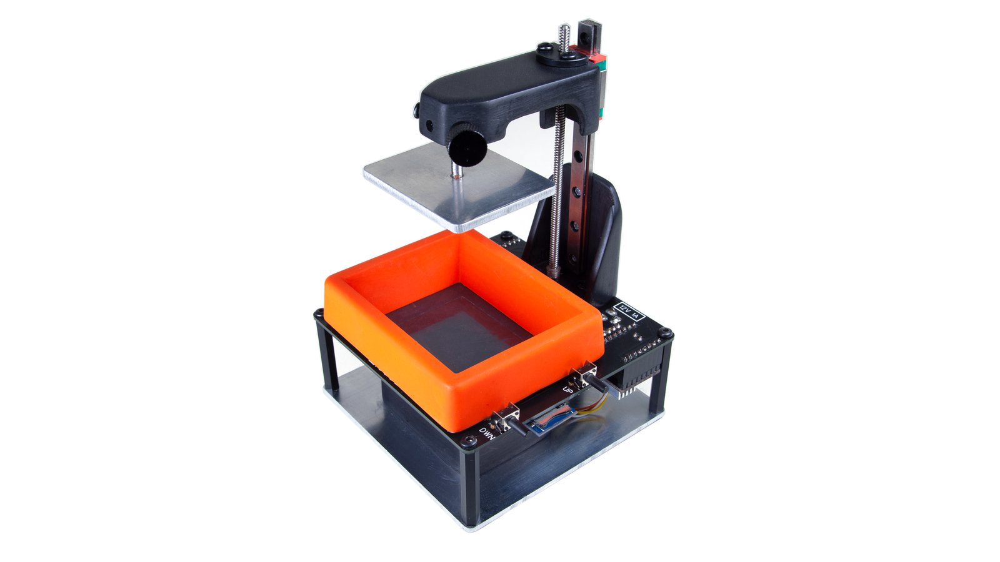

# Lite3DP-S1 - A miniature mSLA DLP 3D Printer

- [Lite3DP-S1 - A miniature mSLA DLP 3D Printer](#lite3dp-s1---a-miniature-msla-dlp-3d-printer)
- [Introduction](#introduction)
  - [Features](#features)
  - [Specifications](#specifications)
  - [Proudly Open Source](#proudly-open-source)
- [Using the Printer](#using-the-printer)
  - [File Preparation](#file-preparation)
  - [Printer Setup](#printer-setup)
  - [Preparing the Printing Platform](#preparing-the-printing-platform)
- [Lite3DP Components](#lite3dp-components)
- [Community Support](#community-support)
- [Troubleshooting](#troubleshooting)
  - [My SD Card is not recognized](#my-sd-card-is-not-recognized)
  - [My printer just prints blobs / My base is a complete blob and failed the rest of the print](#my-printer-just-prints-blobs--my-base-is-a-complete-blob-and-failed-the-rest-of-the-print)
    - [Calibration Your Resin](#calibration-your-resin)
    - [UV LED is too Narrow / Not Spread Out](#uv-led-is-too-narrow--not-spread-out)
- [More Information](#more-information)
- [Copyright and Licenses](#copyright-and-licenses)

# Introduction

**Lite3DP** is a micro 3D printer that utilizes high-print-quality, virtually-silent MSLA technology. It’s the first of its kind to be based entirely on Arduino, be open source, and it comes in an easy-to-assemble kit format. It’s a simple machine that is designed for experimentation and allows for a deep and complete understanding of its operation. And it can fit on just about any desk or in any workshop.

**MSLA resin 3D printing** technology can achieve stunning detail levels and surface finishes, far superior to what filament 3D printers can reach - essentially by curing resin using a screen such as the LCD on Lite3DP. Although 3D printers with MSLA technology are already offered at prices similar to those of filament printers, they are closed source projects, skirting one of the most precious characteristics of modern 3D printing - accessibility.

## Features

Manufactures plastic parts by solidification, layer by layer, of a liquid photosensitive resin
Prints with an extraordinary level of detail and surface finish, far superior to what filament 3D printers can reach
Fits in the palm of your hand
Works with any brand of 405 nm UV resins
Utilizes a precision linear guide
Features a magnetic attachment system on the tray and platform (a single manual knob for its preparation)
Works autonomously with a microSD card
Is well-documented and open source

## Specifications

- **Machine size:** 100 x 100 x 150 mm
- **Technology:** MSLA // LCD-SLA
- **XY resolution:** 0.14 mm
- **Z resolution:** 0.05 and 0.1 mm
- **Build volume (W x L x H):** 45.1 x 33.8 x 70 mm
- **Tray volume:** 50 cm³ (1.7 fl oz)
- **Compatible resins:** All UV 405 nm resins (standard, industrial, flexible, castable, dental, etc.)
- **Data input:** micro SD card autonomous operation
- **Power consumption:** less than 4 W
- **Weight:** less than 350 g (12.3 oz) - perhaps the lightest printer in the world

## Proudly Open Source

This project is fully open source and the software, Arduino firmware, hardware, 3D printing files, and user guide are available here and on the [Lite3DP website](https://www.lite3dp.com/) for you to understand and/or modify. You can also follow progress on [Instagram](https://www.instagram.com/lite.3dp/).

# Using the Printer

## File Preparation

Once you’ve designed your model, it can be prepared for printing using the [CHITUBOX utility](https://www.chitubox.com/). CHITUBOX slices your model into separate images for each print layer, which are then formatted to be read by the machine and uploaded to a microSD card by the Lite3DP Converter application.

## Printer Setup

Once the machine is powered up, and your prepared microSD card has been inserted, all you have to do is:

- Place the magnetic printing platform
- Prepare the printing platform
- Select the file to print on the machine's screen
- Select the printing parameters: layer resolution and exposure settings
- Place the magnetic tray and add resin
- Hit print

It’s that simple. During 3D printing, images corresponding to each slice of the model will be drawn on the screen and thus cured into the resin.

Can’t wait to have the Lite3DP in your hands? You can start using our [online simulator](https://www.lite3dp.com/sim.html?i=1) right now!

## Preparing the Printing Platform

Preparation of the printing platform is done before each print. When setting this, the magnetic printing platform will automatically lower towards the screen and all you need to do is adjust a single knob to lock it.

The height of the automatic approach of the printing platform is set the first time the machine is used and is then permanently saved in the Arduino memory.

# Lite3DP Components

Lite3DP features an all-in-one PCB that includes an Arduino Pro Mini, the driver for the stepper motor, a module for a microSD card, and a screen with dual-functionality: to provide the masking for 3D printing and to allow selection of printing parameters. The PCB also has a structural function, since the motor and the other parts of the machine are attached to it.

The base is made up of 2 mm aluminum plates, which reinforce the structure and allows passive dissipation of the heat from the UV LED, avoiding the need for noisy fans. During operation of the 3D printer, only a soft sounds of the stepper motor are heard intermittently, which is activated for a few seconds at the end of each layer.

Like all MSLA 3D printers, Lite3DP has a single axis of movement, consisting of a stepper motor with metal gear reduction, a precision linear guide, a square thread screw and POM nut.

All kits include an injected-molded plastic tray, developed to avoid any breakage or leakage problems. Trays are also offered separately for those who might need more than one, or for those who make their own machine from scratch and want to ensure good performance.

# Community Support

The community has come together to help each other with their Lite3DPs. Please visit:

- [Reddit](https://www.reddit.com/r/Lite3DP/)
- [Discord](https://discord.gg/rWJaX7USQj)
- [Mods on Github](https://github.com/alt-lite3dp/community)

# Troubleshooting

There are a few common issues have come to light with the components that were chosen for this build. Below are the most common issues and their resolutions.

## My SD Card is not recognized

Most of the SD cards shipped with the printer were not formatted properly. To fix it, use Windows, macOS, or Linux, to re-format the SD card as `FAT32` and copy your files again.

## My printer just prints blobs / My base is a complete blob and failed the rest of the print

There are two common issues that could be happening:

### Calibration Your Resin

Every resin, even refills, needs to be calibrated on a per printer basis. The Lite3DP is no exception.

Te community has published a [Calibration Guide](./Calibration%20guide) that explains how to calibrate your particular resin to maximize the results.

### UV LED is too Narrow / Not Spread Out

We have seen a number of the UV LEDs that are "too focused", especially from Mouser.com kits. What this means is that the light shines too brightly, all focused in the middle of the LCD. You can test this by placing a UV reactive piece of paper (most ink-jet printer paper should work) over the LCD to test the LCD pattern. You should see a wide UV light source, filling the paper edge to edge with no harsh focus in the middle.

If you do see a center area highly focused of UV lights, then most likely you need to diffuse the UV LED to get it to spread out. The community has come up with some `patches` to resolve this. See [this reddit post](https://www.reddit.com/r/Lite3DP/comments/sa4k2z/a_makers_effort_to_patch_the_lite3dps1_to_working/) or matching discord threads [here](https://discord.com/channels/898581358258049095/899086165574037514/934479437746020445) and [here](https://discord.com/channels/898581358258049095/898589927049166899/936603955193065473).

# More Information

For additional information, please visit:

- [Downloads on lite3dp.com](https://lite3dp.com/download.html)
- [Simulator and Setup on lite3dp.com](https://www.lite3dp.com/sim.html?i=1)
- [Latest updates on CrowdSupply](https://www.crowdsupply.com/lite3dp/lite3dp-3d-printer)
- [Assembly Guide on Instructables](https://www.instructables.com/Lite3DP-S1-MSLA-3D-Printer-Arduino-Based-and-Open-/)
- [Stock Photagraphy on Instagram](https://www.instagram.com/lite.3dp/)

# Copyright and Licenses

Copyright (c) 2020, Lite3DP.com

Permission is hereby granted, free of charge, to any person obtaining a copy
of this software and associated documentation files (the "Software"), to deal
in the Software without restriction, including without limitation the rights
to use, copy, modify, merge, publish, distribute, sublicense, and/or sell
copies of the Software, and to permit persons to whom the Software is
furnished to do so, subject to the following conditions:

The above copyright notice and this permission notice shall be included in all
copies or substantial portions of the Software.

THE SOFTWARE IS PROVIDED "AS IS", WITHOUT WARRANTY OF ANY KIND, EXPRESS OR
IMPLIED, INCLUDING BUT NOT LIMITED TO THE WARRANTIES OF MERCHANTABILITY,
FITNESS FOR A PARTICULAR PURPOSE AND NONINFRINGEMENT. IN NO EVENT SHALL THE
AUTHORS OR COPYRIGHT HOLDERS BE LIABLE FOR ANY CLAIM, DAMAGES OR OTHER
LIABILITY, WHETHER IN AN ACTION OF CONTRACT, TORT OR OTHERWISE, ARISING FROM,
OUT OF OR IN CONNECTION WITH THE SOFTWARE OR THE USE OR OTHER DEALINGS IN THE
SOFTWARE.

_source of info:_ <https://www.crowdsupply.com/lite3dp/lite3dp-3d-printer> , <https://github.com/Lite3DP/Lite3DP-S1>  

_source of image:_ <https://www.crowdsupply.com/lite3dp/lite3dp-3d-printer> <https://www.crowdsupply.com/img/2563/lite3dp-side-03-1_png_md-xl.jpg>  
